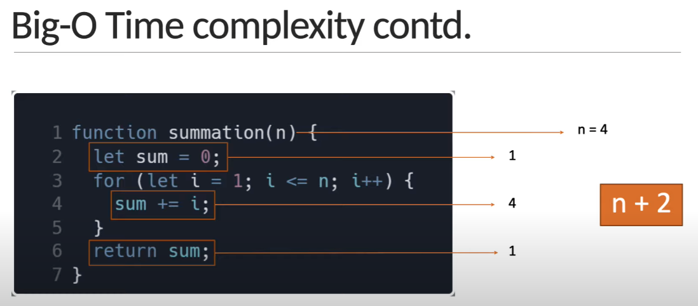
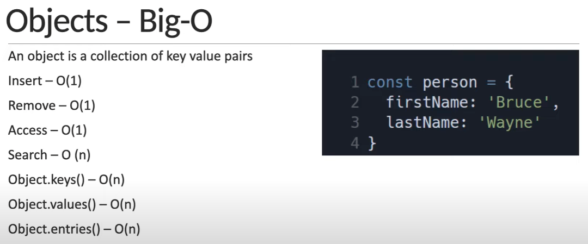
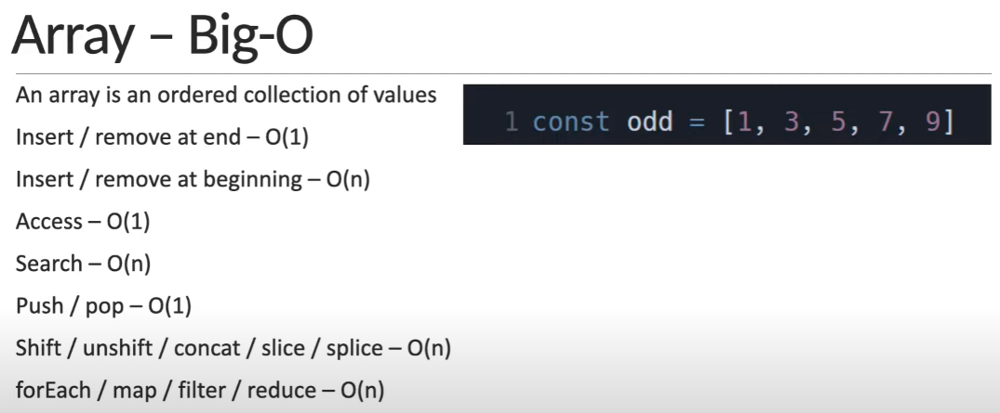

## JavaScript Data Structure
I solve the DSA to different types of data structures and algorithms and their implementations in JavaScript.

## What is a Data Structure?
- A data Structure is a way to store and organize data so that it can be used efficiently.
- A data structure is a collection of data values, the relationships among them, and the functions or operations that can be applied to that data.

## Algorithm analysis contd.
- The absolute running time of an algorithm cannot be predicted, since it depends on a number of factors.
    - Programming language used to implement the algorithm.
    - The computer the program runs on.
    - Other programs running at the same time.
    - Quality of the operating system.
- We evaluate the performance of an algorithm in terms of it's input size.
    - Time complexity - Amount of time taken by an algorithm to run, as a function of input size.
    - Space complexity - Amount of memory taken by an algorithm to run, as a function of input size.
- By evaluating against the input size, the analysis is not only machine independent but the comparison is also more appropriate.
- There is no one solution that works every single time. It is always good to know multiple ways to solve the problem and use the best solution, given your constraints.
- If your app needs to be very quick and has plenty of memory to work with, you don't have to worry about space complexity.
- If you have very little memory to work with, you should pick a solution that is relatively slower but needs less space.

## How to represent time complexity?
Asymptotic notations
- Mathematical tools to represent time and space complexity
    - Big-O Notation (O-notation) - Worst case complexity
    - Omega Notation (Ω-notation) - Best case complexity
    - Theta Notation (Θ-notation) - Average case complexity

### Big-O Notation
- The worst case complexity of an algorithm is represented using the Big-O notation.
- Big-O notation describes the complexity of an algorithm using algebraic terms.
- It has two important characteristics
    - It is expressed in terms of the input.
    - It focuses on the bigger picture without getting caught up in the minute details.
- Big-O Time complexity
function summation(n) {
    let sum = 0;
    for (let i = 1; i <= n; i++) {
        sum += i;
    };
    return sum;
};
summation(4) // 1+2+3+4 = 10
Count the number of times a statement executes based on the input size.

- Big-O time complexity contd.

- It focuses on the bigger picture without getting caught up in the minute details
n + 2      =>     n
n = 100         100+2
n = 1000        1000+2
n = 1000000     1000000+2
- Time complexity O(n) - Linear
- Space complexity
    - O(1) - Constant
    - O(n) - Linear
    - O(logn) - Logarithmic

- Objects and Arrays Big-O

## DSA Roadmap step by step
### Built in data structures 
- Array.js
- Object.js
- Set.js
- Map.js
### Custom data Structures 
- Stack.js
- Queue.js
    - queue1.js //using an array
    - queue2.js //using an object
    - CircularQueue.js
- Linked List
    - prependLinkedList //it's 0(1)
    - appendLinkedList.js //it's 0(n)
    - linkedListNode.js
    - headTailPointer.js
    - linkedListStack.js
    - linkedListQueue.js
- HashTable.js
- Tree
    - BinarySearchTree.js
- Graph

